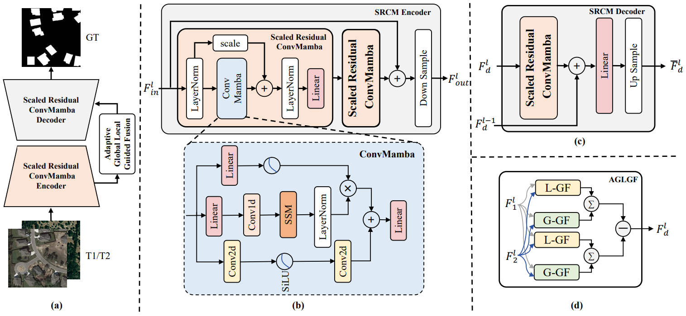

<div align="center">
    <h2>
        CDMamba: Incorporating Local Clues into Mamba for Remote Sensing Image Binary Change Detection
    </h2>
</div>
<br>

<div align="center">
  
</div>
<br>
<div align="center">
  &nbsp;&nbsp;&nbsp;&nbsp;
  <a href="https://ieeexplore.ieee.org/document/10902569">
    <span style="font-size: 20px; ">TGRS</span>
  </a>
  &nbsp;&nbsp;&nbsp;&nbsp;
</div>
<br>
<br>

[](https://github.com/zmoka-zht/CDMamba)
[](LICENSE)
[](https://ieeexplore.ieee.org/document/10902569) 


<br>
<br>


## Introduction

* **` Notice🐍🐍`**: CDMamba has been accepted by [IEEE TGRS](https://ieeexplore.ieee.org/document/10902569)!

The current branch has been tested on Linux system, PyTorch 2.1.0 and CUDA 12.1, supports Python 3.10.

If you find this project helpful, please give us a ⭐️**star**⭐️, your support is our greatest motivation.


## Updates

🌟 **2024.06.20** Released the CDMamba project.

## Benchmark
### Change detection methods supported by the repository
- [X] FC-EF (ICIP'2018)
- [X] FC-Siam-diff (ICIP'2018)
- [X] FC-Siam-conc (ICIP'2018)
- [X] IFN (ISPRS'2020)
- [X] SNUNet (GRSL'2021)
- [X] SwinUnet (TGRS'2022)
- [X] BIT (TGRS'2022)
- [X] ChangeFormer (IGARSS'22)
- [X] MSCANet (JSTARS'2022)
- [X] Paformer (GRSL'2022)
- [X] DARNet (TGRS'2022)
- [X] ACABFNet (JSTARS'2023)
- [X] RS-Mamba (arxiv'2024)
- [X] ChangeMamba (arxiv'2024)
- [X] CDMamba (arxiv'2024)
- [ ] ......

## TODO

- [ ] Updated more change detection methods

## Table of Contents

- [Introduction](#Introduction)
- [Benchmark](#Benchmark)
- [TODO](#TODO)
- [Table of Contents](#Table-of-Contents)
- [Installation](#Installation)
- [Dataset Preparation](#Dataset-Preparation)
- [Model Training and Testing](#Model-Training-and-Testing)
- [Citation](#Citation)
- [License](#License)
- [Contact Us](#Contact-Us)

## Installation

### Requirements

- Linux system, Windows is not tested, depending on whether `causal-conv1d` and `mamba-ssm` can be installed
- Python 3.8+, recommended 3.10
- PyTorch 2.0 or higher, recommended 2.1.0
- CUDA 11.7 or higher, recommended 12.1

### Environment Installation

It is recommended to use Miniconda for installation. The following commands will create a virtual environment named `cd_mamba` and install PyTorch. In the following installation steps, the default installed CUDA version is **12.1**. If your CUDA version is not 12.1, please modify it according to the actual situation.

Note: If you are experienced with PyTorch and have already installed it, you can skip to the next section. Otherwise, you can follow the steps below.

<details open>

**Step 0**: Install [Miniconda](https://docs.conda.io/projects/miniconda/en/latest/index.html).

**Step 1**: Create a virtual environment named `cd_mamba` and activate it.

```shell
conda create -n cd_mamba python=3.10
conda activate cd_mamba
```

**Step 2**: Install dependencies.

```shell
pip install -r requirements.txt
```
**Note**: Please refer to https://github.com/hustvl/Vim or https://blog.csdn.net/weixin_45667052/article/details/136311600 when installing mamba.


</details>


### Install CDMamba


You can download or clone the CDMamba repository.

```shell
git clone git@github.com:zmoka-zht/CDMamba.git
cd CDMamba
```

## Dataset Preparation


### Remote Sensing Change Detection Dataset

We provide the method of preparing the remote sensing change detection dataset used in the paper.

#### WHU-CD Dataset

- Data download link: [WHU-CD Dataset PanBaiDu](https://pan.baidu.com/s/1nh7znToO4XwaZHIOo7gCmw). Code:t2sb


#### LEVIR-CD Dataset 

- Data download link: [LEVIR-CD Dataset PanBaiDu](https://pan.baidu.com/s/1s5352sCRLxu50w2cEfSvWA). Code:qlvs


#### LEVIR+-CD Dataset

- Data download link: [LEVIR+-CD Dataset PanBaiDu](https://pan.baidu.com/s/1ymcsUei7oDyyMUBbpUTGAw ). Code: xtj8


#### Organization Method

You can also choose other sources to download the data, but you need to organize the dataset in the following format：

```
${DATASET_ROOT} # Dataset root directory, for example: /home/username/data/LEVIR-CD
├── A
│   ├── train_1_1.png
│   ├── train_1_2.png
│   ├──...
│   ├── val_1_1.png
│   ├── val_1_2.png
│   ├──...
│   ├── test_1_1.png
│   ├── test_1_2.png
│   └── ...
├── B
│   ├── train_1_1.png
│   ├── train_1_2.png
│   ├──...
│   ├── val_1_1.png
│   ├── val_1_2.png
│   ├──...
│   ├── test_1_1.png
│   ├── test_1_2.png
│   └── ...
├── label
│   ├── train_1_1.png
│   ├── train_1_2.png
│   ├──...
│   ├── val_1_1.png
│   ├── val_1_2.png
│   ├──...
│   ├── test_1_1.png
│   ├── test_1_2.png
│   └── ...
├── list
│   ├── train.txt
│   ├── val.txt
│   └── test.txt
```

## Model Training and Testing

All configuration for model training and testing are stored in the local folder `config`

#### Example of Training on LEVIR-CD Dataset

```shell
python train.py --config/mamba/levir_cdmamba.json 
```

#### Example of Testing on LEVIR-CD Dataset

```shell
python test.py --config/mamba/levir_test_cdmamba.json 
```
#### CDMamba Weight
PanBaiDu download link: [Weight PanBaiDu](https://pan.baidu.com/s/1fSChP8BsK_Yy78GNNd3nzg). Code:ckpt

Google Drive download link [https://drive.google.com/file/d/1ImTvjN-vPnlJtVwfemzeHWcjoNMFsrS7/view?usp=drive_link]

## Citation

If you use the code or performance benchmarks of this project in your research, please refer to the following bibtex citation of CDMamba.

```
@ARTICLE{10902569,
  author={Zhang, Haotian and Chen, Keyan and Liu, Chenyang and Chen, Hao and Zou, Zhengxia and Shi, Zhenwei},
  journal={IEEE Transactions on Geoscience and Remote Sensing}, 
  title={CDMamba: Incorporating Local Clues Into Mamba for Remote Sensing Image Binary Change Detection}, 
  year={2025},
  volume={63},
  number={},
  pages={1-16},
  keywords={Feature extraction;Transformers;Remote sensing;Convolutional neural networks;Visualization;Artificial intelligence;Spatiotemporal phenomena;Computational modeling;Attention mechanisms;Computer vision;Bi-temporal interaction;change detection (CD);high-resolution optical remote sensing image;Mamba;state-space model},
  doi={10.1109/TGRS.2025.3545012}}
```

## License

This project is licensed under the [Apache 2.0 License](LICENSE).

## Contact Us

If you have any other questions❓, please contact us in time 👬
